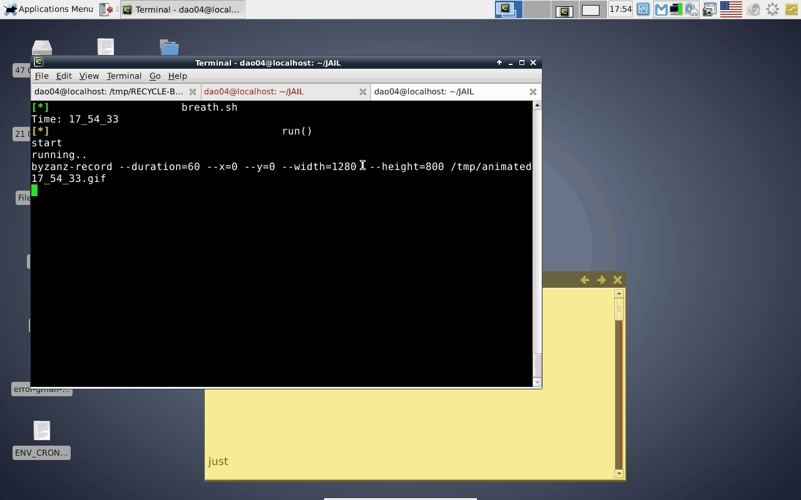

plugin: gmail-group
=
how to use:
---
- run: ./breath.sh gmail-group
- open file: vars.cfg + edit: set your password and username
- edit: gmail-notify configuration at: ~/.notifier.conf (optional: use my settings: at:./BAK/notifier.conf )

[demo2](./.GIF/plugin-gmail-group-2.gif)
[demo3](./.GIF/plugin-gmail-group-3.gif)
[demo4](./.GIF/plugin-gmail-group-4.gif)

