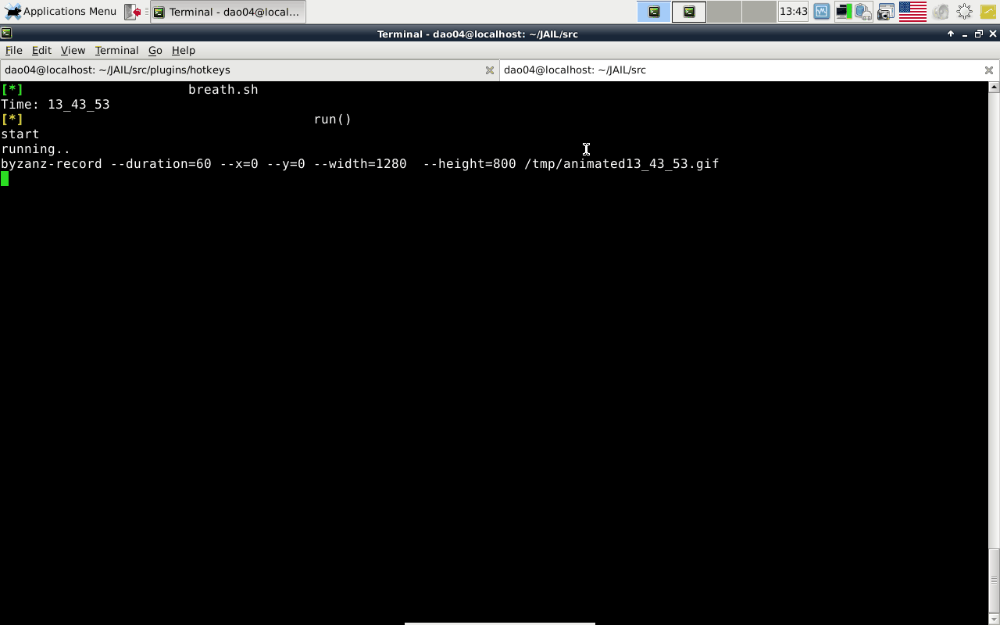

plugin: Hotkeys
==========

how to use ?
------------------
```
#add 1 command:
vi menu/options.txt 

#test our addition:
./wrapper.sh

#set the key-combination:           alt+f3: to execute: ./wrapper.sh
cd plugins/hotkeys
xfconf-query -c xfce4-keyboard-shortcuts -p "/commands/custom/<Alt>F3" -t string -s "$PWD/wrapper.sh" --create

#add sub-menus:
vi menu/url.txt
```
- I am sure - that's exctly what a pilot feels when he navigates between clouds    :)


[demo2](./.GIF/demo_sub_menus.gif)
