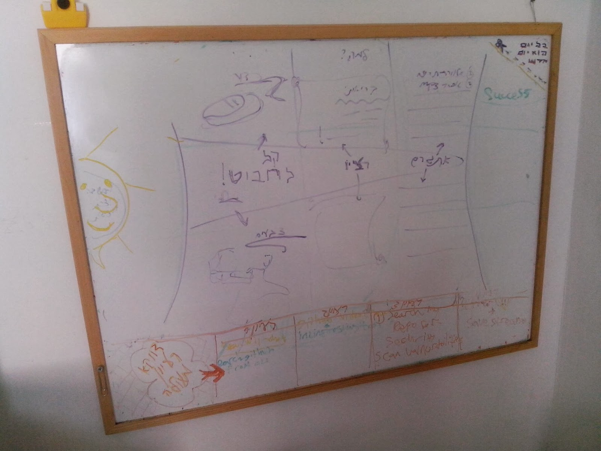

[](https://travis-ci.org/brownman/do_for_others_first)

Do For Others First
=

#### Todo:
- debian package - easy to install
- .travis: add tests for: self.sh
- activate plugin: google-group: push lpi-exam-question every 5 minutes

#### ChangeLog:
- 2-3-2014 : restore the working library - and tag it with a version 0.0.1
- 1-3-2014 : interpreter: Selfish - first version for a new language
- 26-2-2014: workspace: restrict writing permission to the folder: dir_workspace
- 26-2-2014: divide rc files to: private(series of tasks)/public
- 26-2-2014: use bash_koans testing + .cfg files at: rc/public 
- 22-2-2014: rings/ : revived the skeleton of the old project: Magnify_The_Small
- 17-2-2014: global: scaffolding:      +for plugin creation
- 17-2-2014: plugin: hotkeys           +presenration
- 16-2-2014: plugin: gmail-group       +presentation
- 16-2-2014: plugin: screencast        ++new

#### Design:
- layout: prompt the tree
- readme: divide to many , don't link
- workspace: exist on each sub-project


step by step instructions:
---------------------------------


```shell
cd /tmp #just for demonstration
sudo apt-get install git
git clone https://github.com/brownman/do_for_others_first.git
./breath.sh
echo "create or use a plugin:"
```


 


Works:
-----------
* [works](./works) - this project is a composition of couple of sub-projects.


The Library:
----------
* [using the library](./rc) - loading .cfg files using a better syntax than: source filename.cfg 


[My whiteboard](./WHITEBOARD)


#### Rules:
- script closer to the root directory must be smaller in size

ref:
--
[markdown editor] ( http://markable.in/editor/ )
[github flavour](https://help.github.com/articles/markdown-basics#links)
[smilies](http://www.emoji-cheat-sheet.com/)
[mastering](http://guides.github.com/overviews/mastering-markdown/)
[editor](http://dillinger.io/)
[lexers](https://github.com/github/linguist/blob/master/lib/linguist/languages.yml)
[github-guide](http://guides.github.com/)
