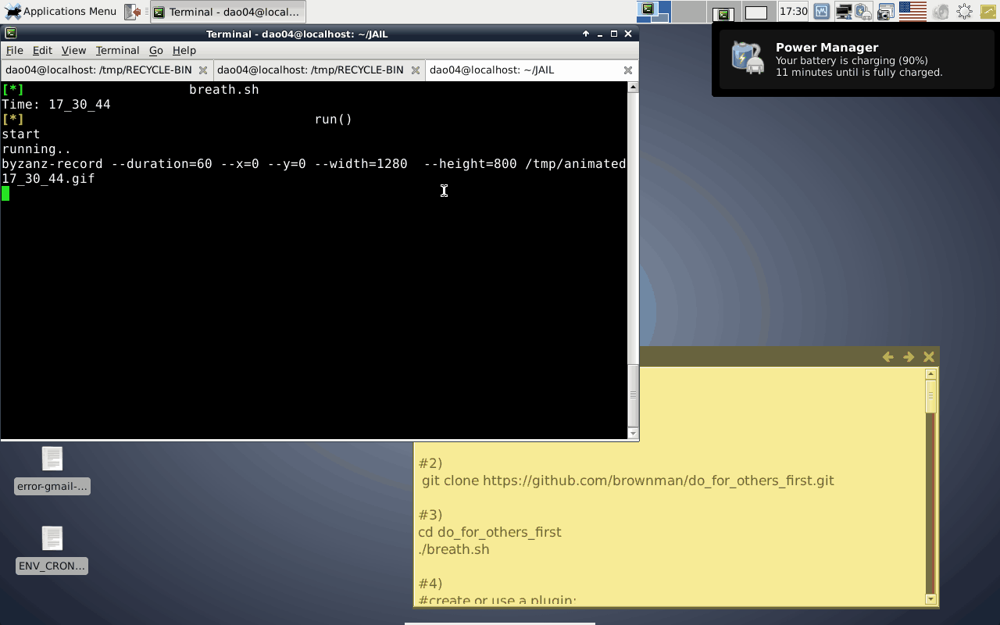

[](https://travis-ci.org/brownman/do_for_others_first)
#### Todo:
- debian package - easy to install
- .travis: add tests for: self.sh
- activate plugin: google-group: push lpi-exam-question every 5 minutes

#### ChangeLog:
- 22-2-2014: rings/ : revived the skeleton of the old project: Magnify_The_Small
- 17-2-2014: global: scaffolding:      +for plugin creation
- 17-2-2014: plugin: hotkeys           +presenration
- 16-2-2014: plugin: gmail-group       +presentation
- 16-2-2014: plugin: screencast        ++new


Do For Others First
=
step by step instructions:
---------------------------------


```shell
cd /tmp #just for demonstration
sudo apt-get install git
git clone https://github.com/brownman/do_for_others_first.git
./breath.sh
echo "create or use a plugin:"

```


 


Plugins:
-----------

Each plugin located under: $project_root/src/1_dev/plugins

* [hotkeys](./src/1_dev/plugins/hotkeys) - update the key-combination of your system for ..productivity (obviously! - I wonder why I didn't use this wonderful option till now)
* [screencast](./src/1_dev/plugins/screencast) - recored your desktop - with the minified way - and save it as animated.gif
* [gmail-group] (./src/1_dev/plugins/gmail-group) - utilize google mail service to allow quick messaging between people who share an email account (Whatsup style).


[My whiteboard](./.WHITEBOARD)


#### Rules:
- script closer to the root directory must be smaller in size

ref:
--
[markdown editor] ( http://markable.in/editor/ )
[github flavour](https://help.github.com/articles/markdown-basics#links)
[smilies](http://www.emoji-cheat-sheet.com/)
[mastering](http://guides.github.com/overviews/mastering-markdown/)
[editor](http://dillinger.io/)
[lexers](https://github.com/github/linguist/blob/master/lib/linguist/languages.yml)


