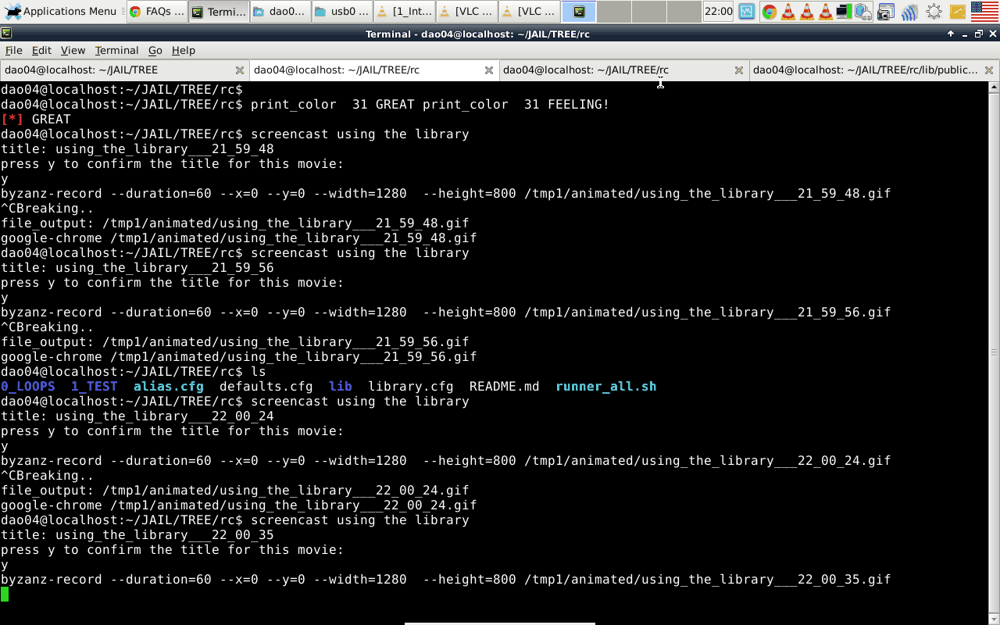

USING THE  LIBRARY:
----------------------------
_

###Example:
```sh

#say: we want to load the file: color.cfg
cd $dir_root/rc
tree -L 3 lib/public/color
#the common way:
#option1: source color.cfg


#option2: use the library:
use public.color.color
type print_color
print_color  31 HELLO 
print_color  31 WORLD
print_color  31 I 
print_color  31 AM
print_color  31 FEELING
print_color  31 GREAT !!!
```
